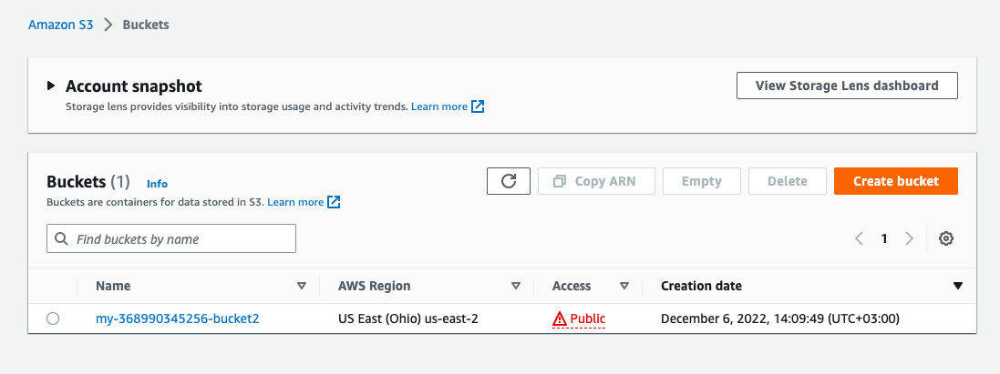
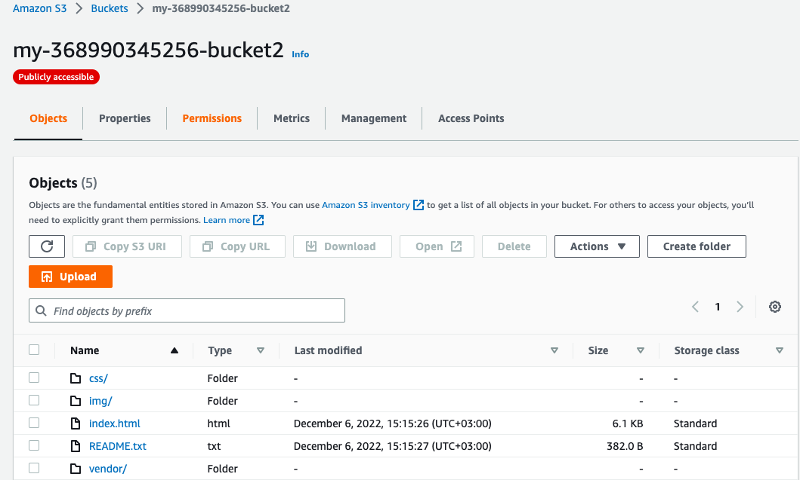
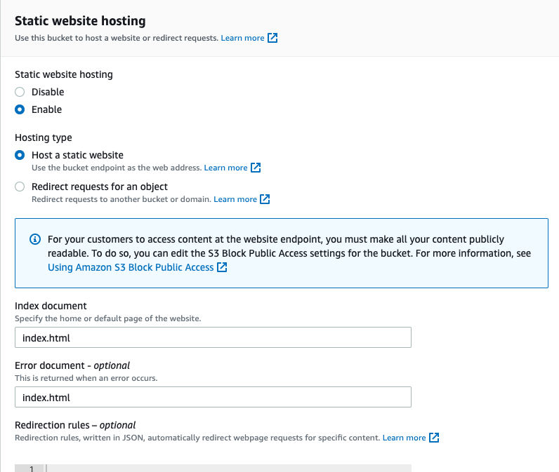
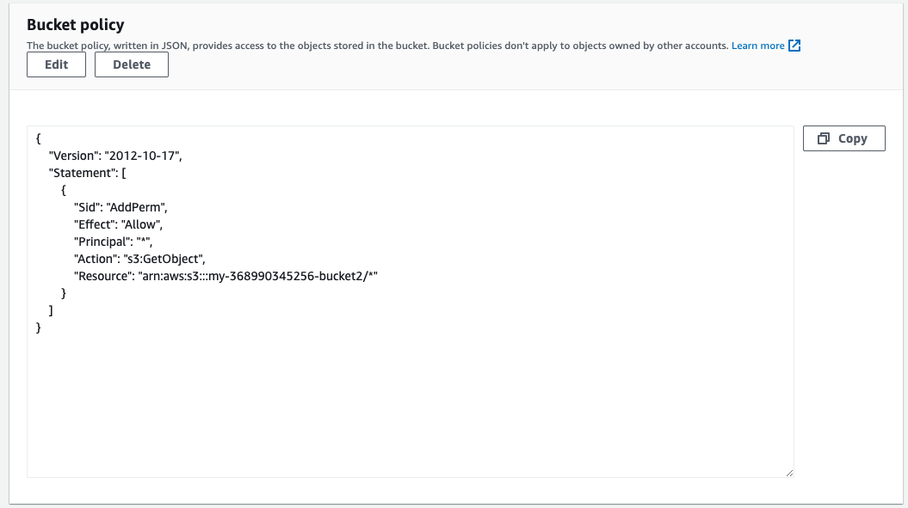
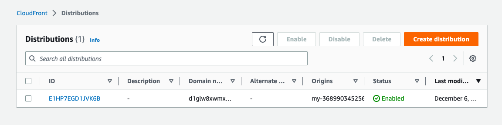
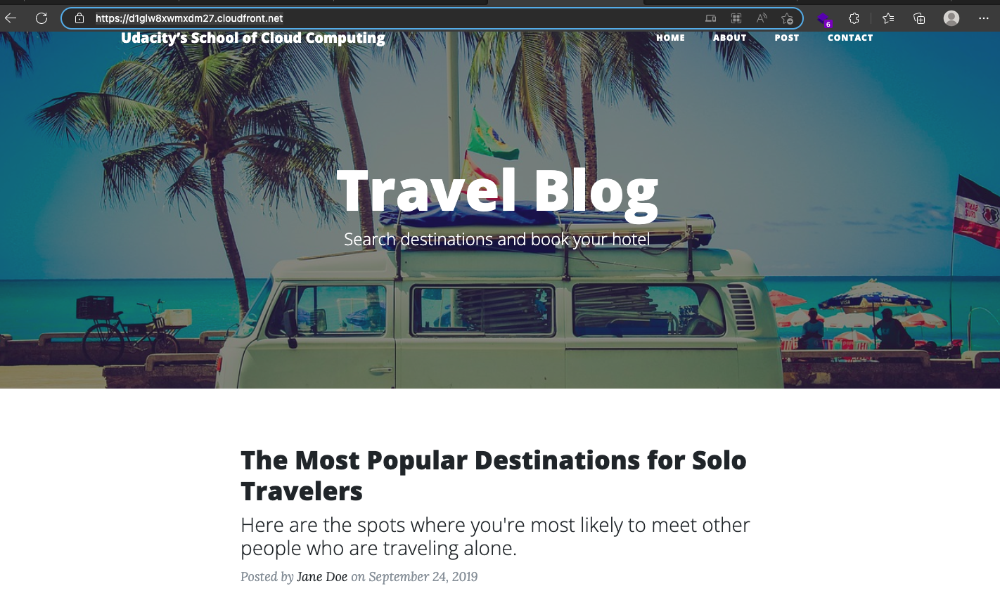
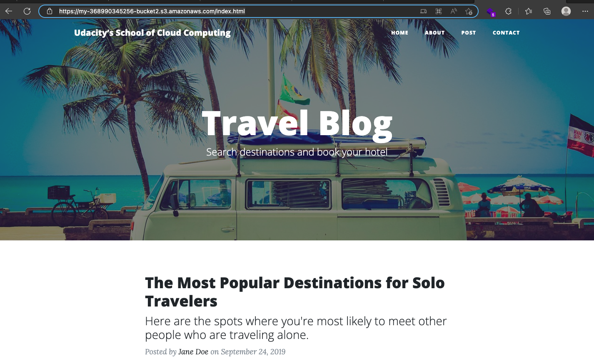

# ALX-T CLOUD DEVELOPER NANODEGEREE

## PROJECT ONE: DEPLOY A STATIC WEBSITE:

### S3 BUCKET IS CREATED:
**The S3 bucket creation screenshot is at: screenshots/s3-bucket-created.png**

### S3 BUCKET CONTENT:
**The bucket contains static files(images, html and css)**

*The screenshot is at: screenshots/s3-bucket-contents.png*

### S3 BUCKET SUPPORTS STATIC WEBSITE HOSTING

**The bucket is configured to host static files. Find the exposed address below.**

[static-website-address](http://my-368990345256-bucket2.s3-website.us-east-2.amazonaws.com)

### S3 BUCKET attached to IAM bucket policy that makes the bucket contents publicly accessible

**Bucket policy can be previed under the permissions tab as shown**

### WEBSITE DISTRIBUTION

**CloudFront has been configured to retrieve and distribute website**

### WEB BROWSER  ACCESS

**The following endpoints are accessible via the browser**

*CloudFront domain name*

[cloud-front](https://d1glw8xwmxdm27.cloudfront.net/)

*Website endpoint*

[website-endpoint](http://my-368990345256-bucket2.s3-website.us-east-2.amazonaws.com/)

*S3 Object URL*

[s3-object-url](https://my-368990345256-bucket2.s3.amazonaws.com/index.html)

